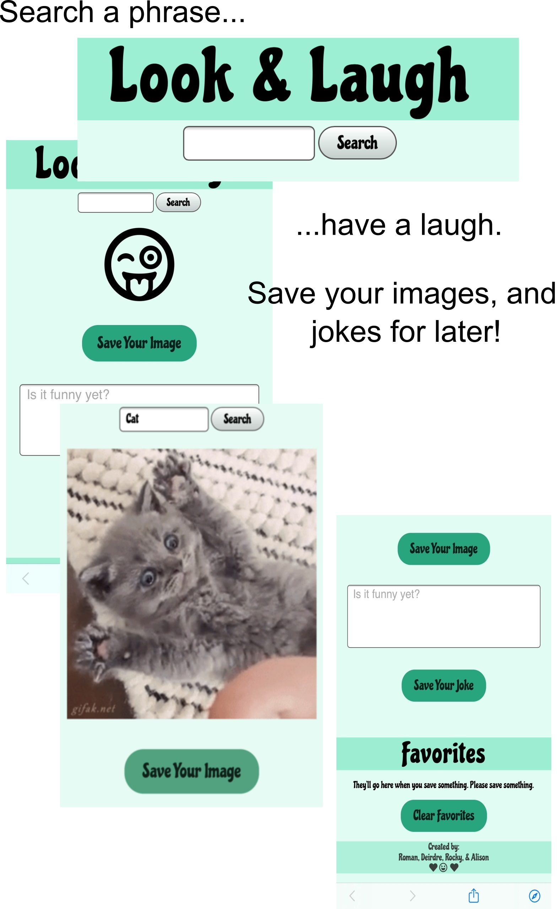

# Link to the deployed website
https://theoriginalison.github.io/look-laugh/ 

## Files and Directories
```
index.html
script.js
style.css
README.md
>images 
```

## look-laugh
Files contain the Look and Laugh App. A mental health and wellness 
application to help relieve stress and anxiety. 

Description: Look & Laugh App
"Search a word, have a laugh. Save your images, and jokes for later. Happy Searching!"

As developers of the University of Pennsylvania LPS Bootcamp, we wanted to develop an application that would allow coders to take a quick break to destress
and refocus. The "Look & Laugh" gives coders a way to break a laugh quickly. 

The technologies used were:
Zoom, Google Docs, Slack, GitHub, API's, Google Font's, HTML, CSS, Pure.css, Javascript, jQuery, AJAX, and Local Storage. For a more extensive preview of each visit the Look & Laugh Google Documentation. 


Button configurations: 

- Search: Returns a randomized image, and/or joke based on user’s search input.
- Save: Images, and jokes will be sent to "Favorites" section for user to view later. 
- Clear: User can clear images, and joke from "Favorites section".



## Credits
© 2020 Roman, Deirdre, Rocky, & Alison


